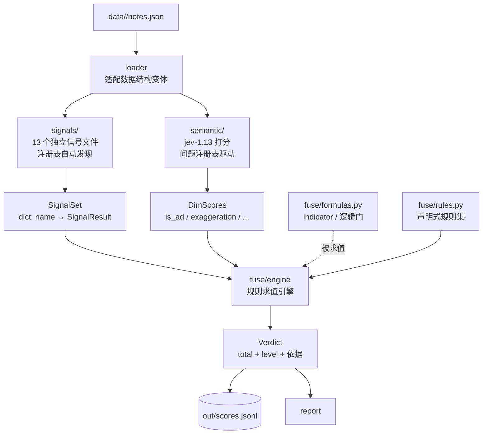

# jev2 —— 种草真实性判别系统 · 可扩展框架设计

> 状态：**PLAN v2（待确认后动工）**
> 前置：旧 jev 已重命名 `legacy-jev/`，保留为对照基线（95.8% 二值一致率）
> 数据：`data/<note_id>/notes.json`（40 篇，新结构，已验证）
> 决策器：jev-1.13（OpenCode Zen `systemone`），key 从 opencode `auth.json` 读

---

## 0. 设计总纲：每个「没敲定」都对应一个确定的扩展点

你说的三处「还没敲定」，框架里各有一个**专门的接缝**来承接它们 ——
不确定的不是问题，关键是别把不确定的东西**焊死**在代码里：

| 你说的没敲定 | 承接它的扩展点 | 以后改的时候动哪里 |
|---|---|---|
| 信号层要可扩展 | `signals/` 一信号一文件 + **注册表自动发现** | 加一个文件即生效，零处修改 |
| 语义层输出维度未定 | `semantic/questions.py` **问题注册表** + config 声明启用哪些 | 改配置 + 加一个 QuestionSpec |
| 融合决策未定（indicator / 逻辑门） | `fuse/formulas.py` **公式库** + `fuse/rules.py` **规则集** | 引擎不动，换规则数据 |

核心原则：**引擎写一次，内容全部数据化。**

---

## 1. 架构总览



数据流是**单向的**：`loader → signals/semantic → fuse → store`。
每一层的输入输出都是 `dataclass`，没有隐式共享状态。

---

## 2. 目录结构

```
jev2/
  pyproject.toml
  src/jev2/
    __init__.py            # 版本 + 顶层导出
    config/
      __init__.py          # load_config()：默认 → 文件 → 环境变量 → overrides
      schema.py            # 全部 dataclass + 默认值 + schema_version
    core/
      types.py             # NoteRecord / SignalResult / DimScore / Verdict
      errors.py            # ConfigError / ProviderError / DataError ...
      registry.py          # 通用注册表（signals 与 questions 共用）
    loader.py              # notes.json → NoteRecord（唯一认识数据结构的地方）
    signals/               # ★ 一信号一文件，注册表自动发现
      __init__.py          # import 包时自动注册全部信号
      base.py              # Signal 协议 + @signal 装饰器 + SignalSet
      _lib.py              # 共享数学工具：safe_div / entropy / iqr
      like_comment_ratio.py
      comment_like_rate.py
      ip_top1_ratio.py
      ip_entropy.py
      comment_len_sd.py
      comment_len_mean.py
      comment_len_iqr.py
      author_reply_ratio.py
      sub_reply_ratio.py
      comment_time_span.py
      nickname_dup_rate.py
      text_exclaim_density.py
      text_length.py
    semantic/
      provider.py          # jev-1.13 HTTP 客户端（从 legacy-jev 移植，已验证）
      questions.py         # 问题注册表（沿用已 A/B 校准的措辞）
      runner.py            # state 拼装 + 调用 + 解析 → tuple[DimScore]
    fuse/
      formulas.py          # ★ 指标函数 / 逻辑门（纯函数库）
      rules.py             # ★ 声明式规则集（Rule dataclass 列表）
      engine.py            # 求值引擎：context + rules → Verdict
    pipeline/
      runner.py            # 编排：load → signals → semantic → fuse → store
      store.py             # out/scores.jsonl 读写（幂等：note_id 主键）
    report.py              # 风险分布 / Top 清单 / 信号明细
    cli.py                 # judge / report / calibrate
  tests/
    test_registry.py
    test_signals.py        # 每个信号一组用例
    test_formulas.py
    test_rules.py
    test_engine.py
    test_loader.py
    test_pipeline.py
  docs/
```

---

## 3. 四个扩展点的具体设计

### 3.1 信号层：一信号一文件 + 注册表

每个信号文件长这样（以 `comment_len_sd.py` 为例，全部同构）：

```python
# jev2/src/jev2/signals/comment_len_sd.py
"""评论长度标准差 —— 刷评整齐、真实讨论长短不一。

依据：legacy-jev 实测 AUC 0.853（n=42，tools/validate_signals.py）。
"""
from .base import signal, SignalResult
from ._lib import lens_of, sd

NAME = "comment_len_sd"


@signal(NAME, group="comments")
def compute(record, *, ctx) -> SignalResult:
    ls = lens_of(record.comments)            # 评论正文字符长度列表
    n = len(ls)
    if n < 3:                                # 样本不足必须显式声明，不装作有值
        return SignalResult.missing(NAME, f"n={n} < 3")
    return SignalResult.ok(NAME, value=sd(ls), n=n,
                           detail={"mean": sum(ls) / n})
```

`base.py` 的注册表：

```python
@dataclass(frozen=True)
class SignalResult:
    name: str
    value: float | None      # 归一到 0..1；None = 缺失（带原因）
    n: int = 0               # 样本量
    detail: dict = field(default_factory=dict)
    missing_reason: str = ""


_SIGNALS: dict[str, Callable] = {}


def signal(name, *, group):                 # 装饰器 = 注册
    def deco(fn):
        _SIGNALS[name] = fn
        fn.signal_name = name
        fn.signal_group = group
        return fn
    return deco


class SignalSet:
    """对一篇 NoteRecord 跑全部（或配置选定的）信号。"""

    def compute(self, record, only=None) -> dict[str, SignalResult]:
        out = {}
        for name, fn in _SIGNALS.items():
            if only and name not in only:
                continue
            try:
                out[name] = fn(record, ctx=self)
            except Exception as exc:        # 单信号挂了不拖垮整篇
                out[name] = SignalResult.missing(
                    name, f"{type(exc).__name__}: {exc}")
        return out
```

**扩展方式**：往 `signals/` 丢一个新文件、定义 `@signal`，完事 ——
`signals/__init__.py` 用 `pkgutil` 自动发现导入，不需要在任何地方登记。
`config.toml` 里 `signals.active = [...]` 决定哪些参与融合。

### 3.2 语义层：问题注册表 + 维度配置化

```python
# semantic/questions.py —— 问题也是注册表，和 signals 同一套 registry
QUESTIONS = {
    "is_ad":        QuestionSpec(noul=...),          # 已 A/B 校准的措辞
    "exaggeration": QuestionSpec(score=..., lo=..., hi=...),
    "has_risk":     QuestionSpec(score=..., lo=..., hi=...),
    "is_cta":       QuestionSpec(score=...),
}
```

- 问题的**措辞是数据**（`QuestionSpec`），改措辞不改 runner
- config 声明 `semantic.dims = ["is_ad", ...]` 与各维 `weights`
- state 拼装规则也配置化：`semantic.state = {include_title, top_comments: 10}`
- provider 从 `legacy-jev/src/jev_guard/providers/jev.py` **原样移植**
  （UA/限流/重试都实测过）；依赖只进 `semantic/`，signals 永不依赖它

### 3.3 融合层：公式库与规则集分离（你要求的结构）

**`fuse/formulas.py` —— 纯函数库，只算数，不做决策：**

```python
# ── 指标函数（indicator functions）──────────────────
def indicator_ge(x, t):        return float(x >= t)         # ≥ 阈值 → 1
def indicator_band(x, lo, hi): return float(lo <= x <= hi)
def linear(*, value, lo, hi):  # 线性映射到 0..1
def logistic(*, value, k, x0): # 平滑版

# ── 逻辑门 ─────────────────────────────────────────
def AND(*vals):         return float(all(v > 0.5 for v in vals))
def OR(*vals):          return float(any(v > 0.5 for v in vals))
def NOT(v):             return float(v <= 0.5)
def at_least(k, *vals): ...

# ── 聚合 ──────────────────────────────────────────
def weighted(dims, weights) -> float
def gate_veto(total, *, gate_dim, gate_value, threshold) -> float
```

全部纯函数、无状态、逐个单测 —— **决策数学的唯一真相源**。

**`fuse/rules.py` —— 声明式规则集，决策逻辑在这里：**

```python
@dataclass(frozen=True)
class Rule:
    name: str
    formula: Callable | None         # 引用 formulas 里的纯函数
    args: dict                       # 参数（阈值等）—— 数据
    inputs: tuple[str, ...]          # 从 context 取哪些键
    action: str                      # "veto" | "contribute" | "flag"
    weight: float = 0.0
    note: str = ""


DEFAULT_RULES = (
    Rule(name="ad_gate", formula=indicator_ge,
         args={"t": 0.85}, inputs=("is_ad",), action="veto",
         note="is_ad≥0.85 一票否决（legacy 实测：高风险召回 40%→100%）"),
    Rule(name="risk", weight=0.35, inputs=("has_risk",), action="contribute"),
    Rule(name="exag", weight=0.30, inputs=("exaggeration",), action="contribute"),
    Rule(name="ad",   weight=0.25, inputs=("is_ad",), action="contribute"),
    Rule(name="cta",  weight=0.10, inputs=("is_cta",), action="contribute"),
    Rule(name="l2",   weight=0.15, inputs=("l2_mean",), action="contribute"),
)
```

**`fuse/engine.py` —— 引擎，写一次就不动：**

```python
class FuseEngine:
    def evaluate(self, context: dict, rules=DEFAULT_RULES) -> Verdict:
        # 1. 依次求值 veto 规则 → 命中直接 HIGH
        # 2. 汇总 contribute 规则 → weighted total
        # 3. thresholds 映射 total → level（映射规则在 config）
        # 4. Verdict 带 rationale：每条规则是否命中、贡献多少
```

**换决策逻辑 = 换 `rules.py` 里的规则列表（或从 config 加载），引擎零改动。**
以后想加逻辑门组合 —— 加一条
`Rule(formula=AND, inputs=("is_ad", "exaggeration"))` 就行。

### 3.4 config：所有不确定量的家

```toml
# jev2/config.toml（可省，全部有内置默认值）
schema_version = 1

[paths]
data_root = "data"
out_dir   = "out"

[signals]
active = ["comment_len_sd", "ip_top1_ratio", "..."]   # 空 = 全部

[semantic]
model = "jev-1.13"
dims  = ["is_ad", "has_risk", "exaggeration", "is_cta"]
state = { include_title = true, top_comments = 10 }

[fuse]
# 未敲定的都在这
level_map = { high = 0.70, low = 0.30 }   # 三档；改二值只改这里
rule_set  = "default"                     # rules.py 里的具名规则集
weights   = { has_risk = 0.35, exaggeration = 0.30,
              is_ad = 0.25, is_cta = 0.10, l2_mean = 0.15 }
```

`schema_version` 进 config 也进产物 —— 以后配置格式变了，
旧结果文件仍能解读。

---

## 4. 关键工程决定

### 4.1 loader 是唯一认识数据结构的地方

`notes.json` 现在一种结构；将来 `--out` 结构若变、或要接旧目录，
只改 `loader.py`。产出 `NoteRecord`（不可变 dataclass）：

```python
@dataclass(frozen=True, slots=True)
class NoteRecord:
    note_id: str
    title: str
    desc: str
    tags: tuple[str, ...]
    author: str
    liked: int            # 统一转 int；""/"-1" → 0 并在 raw 里留痕
    comment_count: int
    comment_count_l1: int
    share: int
    published_ms: int
    comments: tuple[CommentRow, ...]   # 已摊平，含 _is_reply
    images: tuple[str, ...]
    source_path: Path
```

### 4.2 缺失是一等公民

每个信号都可能「没数据」（评论 0 条、样本 <3）。契约：
`SignalResult.missing(name, reason)`，融合时**跳过并记录**，绝不拿 0 冒充。
`Verdict.rationale` 里能看到「哪些信号缺席、为什么」。

### 4.3 幂等与可复现

- `store.py` 按 `note_id` 主键 upsert；重跑不重复
- 每行产物带 `schema_version` / `config_hash` / `run_id` ——
  改了阈值之后，旧结果不会被静默覆盖语义
  （能区分「旧阈值跑的」和「新阈值跑的」）

### 4.4 provider 移植清单（从 legacy-jev，全部实测过的坑）

| 继承 | 原因 |
|---|---|
| `BROWSER_UA`（Chrome 131） | Cloudflare 拦 Python 默认 UA（403 code 1010） |
| QPS / min_interval 节流 | 429 保护 |
| 指数重试 | 网络抖动 |
| key 掩码（`***`） | 日志/产物永不落明文 |
| 一次调用问多题（questions map） | 省 tokens（$0.042/1M） |

### 4.5 key 的读取（不落明文）

```python
# $JEV2_API_KEY > opencode auth.json（已确认在本机存在）
AUTH_CANDIDATES = (
    Path.home() / ".local/share/opencode/auth.json",
    Path.home() / ".config/opencode/auth.json",
    Path(os.environ.get("APPDATA", "~")) / "opencode/auth.json",
)
# 依次找 opencode-go / opencode / zen 三个 provider，取 dict["key"]
# config.to_dict() 里 api_key 恒为 "***"
```

### 4.6 legacy-jev 的角色

对照基线 + 措辞来源。jev2 上线前必须在同一批 40 篇上对打
（一致率 / kappa / 高风险 F1），赢不了就不替换。

---

## 5. 实施步骤

| 步 | 内容 | 验收标准 |
|---|---|---|
| **P1** | 骨架：config / core.types / registry / loader + 1 个示范信号 | `judge --note <id>` 能出 Verdict（信号部分） |
| **P2** | 13 个信号文件 + `_lib.py` + 全部单测 | 每信号有用例；40 篇全跑出 SignalSet |
| **P3** | semantic：provider 移植 + questions 注册表 + runner | 40 篇语义打分落盘，成本 < $0.01 |
| **P4** | fuse：formulas 库 + DEFAULT_RULES + engine + 单测 | gate 命中/未命中、加权、缺信号跳过都有用例 |
| **P5** | pipeline + store + cli（judge/report） | `jev2 judge --all` + `jev2 report` 出完整报告 |
| **P6** | 对比 legacy-jev + calibrate（需你人工判 10~15 篇） | 对打报告；阈值固化 |

P1~P5 纯代码；P6 的 calibrate 需要你给 ground truth。

---

## 6. 未敲定清单（框架已给位置，定了就填）

| # | 未决事项 | 现在的默认 | 定了以后动哪里 |
|---|---|---|---|
| 1 | 语义维度最终集合 | 4 维（is_ad/has_risk/exaggeration/is_cta） | questions.py 加 spec + config 加权重 |
| 2 | 融合公式 | gate + 加权平均 | rules.py 换规则集 / config 改权重 |
| 3 | 输出档位 | 三档（0.70/0.30） | config `level_map`，引擎不动 |
| 4 | 「种草」定义 | 按「真实性」判 | 改 questions 措辞（数据，非代码） |
| 5 | 哪些 L2 信号进权重 | 只展示不进（等 ground truth） | config `weights` 加键即生效 |
| 6 | 逻辑门用哪些 | 只有 ad_gate 一条 veto | rules.py 加 `Rule(formula=AND/OR/...)` |

---

## 7. 动工确认（回我这 4 个就行）

1. 输出**三档**还是**二值**？（默认三档，config 一行可切）
2. P6 需要你人工判 10~15 篇 —— 你来做这步吗？
3. `jev2/config.toml` 要进仓库吗（里面没有 key，只有阈值/权重）？默认**进**，方便复现。
4. 第一版先跑 P1~P5（全代码，无你的输入），出完报告等你判读 —— 一次做完还是每步停下给你看？
