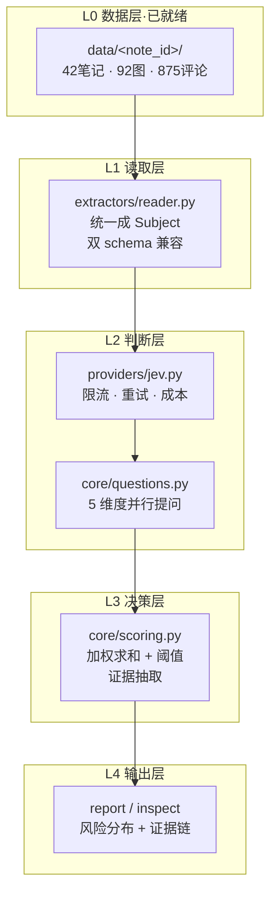

# jev-guard 落地规划

> 目标：把「已有小红书数据 + jev-1.13」变成一条**可复现、可解释、可演示**的内容核验流水线。
>
> 本文是执行清单，每个阶段都有明确的产出物、验证方式和退出条件。

---

## 零、先纠正一个方向性错误

在写代码前必须记录，否则后面会走回头路。

**我曾经用 jev 去预测「评论会不会被点赞」，然后得出「jev 没用」的结论。这是错的。**

```
A 纯回归(11 表层特征)   AUC = 0.559 ± 0.037
B 纯 jev (3 语义特征)    AUC = 0.433 ± 0.040   ← 比抛硬币还差
C 混合 (14 特征)         AUC = 0.530 ± 0.050
置换检验 p = 0.697 →不显著
```

三个错误：

1. **任务选错了**。「评论热度」和「内容是否虚假」没有因果关系。
2. **样本量不足**。160 条里只有 19 个正样本，统计功效不够。
3. **推理方向错了**。内容核验要的是「判断」，不是「预测」。

**正确认知**：jev 是 **System One 判断器**，输入 state、输出带类型的概率。
它不是特征生成器，不该被塞进回归里当特征。

| |用途 | 是否需要训练 |
|---|---|---|
| jev | 判断「这条内容有没有夸大/ 是广告」 | 否 |
| 逻辑回归 | 预测「这条评论会不会被赞」 | 是 |

本项目只做前者。

---

## 一、前提条件

### 1.1 数据现状（已就绪）

```
data/<24位hex>/
├── content/note.json      中文或英文 schema（见 §5.1）
├── content/note.md
├── images/urls.json
├── images/01.jpeg ...
└── comments/
    ├── comments.json      扁平列表：一级 + 楼中楼
    └── card.json          统计卡片
```

实测：**42 篇笔记 / 92 张图 / 875 条评论**

| 维度 | 数量 | 备注 |
|---|---|---|
| 文案 | 42/42 | ✅ 全齐 |
| 图片 | 42/42 | ✅ 全齐 |
| 评论 | 38/42 | 4 篇是平台真 0 评论，非失败 |

### 1.2 API key（已就绪）

```
~/.local/share/opencode/auth.json → opencode-go provider
```

**不依赖它**：`$JEV_API_KEY` 优先，其次才是 auth.json。

### 1.3 ⚠️ 免费额度已耗尽

```
jev-1.13-free 实测 254 次请求后 → HTTP 429 FreeUsageLimitError
```

**三个应对方案**（按推荐度）：

| 方案 | 成本 | 说明 |
|---|---|---|
| **A. 用付费 `jev-1.13`** | 873 条 ≈ **$0.01** | 推荐。`--model jev-1.13` 即可 |
| B. 等免费额度恢复 | $0 | 不确定，限时额度 |
| C. 用已有 42篇标签 | $0 | 笔记级已完整，够演示 |

**决策建议**：先走 C 打通全链路验证代码，同时用 A 补全评论级。
不要因为限流阻塞开发。

---

## 二、系统架构

### 2.1 分层



### 2.2 模块职责与边界

| 模块 | 输入 | 输出 | 不做什么 |
|---|---|---|---|
| `core/config.py` | 环境变量/文件/CLI | `Config` | 不读业务数据 |
| `core/models.py` | jev 原始响应 | `Label`/`RiskScore` | 不做 IO |
| `core/questions.py` | — | `QuestionSpec` | 不含业务逻辑 |
| `core/scoring.py` | `Label` + 正文 | `RiskScore` | **纯函数，无 IO** |
| `providers/jev.py` | state + specs | 原始 JSON | 不解释业务含义 |
| `extractors/reader.py` | `data/` | `Subject` | 不调模型 |
| `pipeline/batch.py` | `Iterable[Subject]` | `BatchResult` | 不做评分 |
| `pipeline/score.py` | 标签 + 配置 | 评分文件 | 不调模型 |

**关键约束**：`core/` 不依赖 `providers/` 和 `extractors/`。
这保证核心逻辑可以完全离线单测（67 个测试，不需要 API key）。

---

## 三、五个阶段

### 阶段 0：环境验证（已完成）

**做什么**：
```bash
python -m jev_guard doctor
```

**验证点**：
- [x] key 能解析（掩码显示，不打印明文）
- [x] endpoint 可达
- [x] 模型能返回带类型的答案
- [x] `data_root` 存在且有 42 篇

**当前状态**：✅ 通过（429 是限流，不是配置问题）

---

### 阶段 1：打标（标签层）

**做什么**：给 42 篇笔记 + 875 条评论打 jev 标签。

```bash
# 笔记（5 个维度并行，1 次请求）
python -m jev_guard label --kind note

# 评论（3 个维度并行）
python -m jev_guard label --kind comment --model jev-1.13
```

**技术细节**：

| 项 | 设计 | 理由 |
|---|---|---|
| 提问数| 笔记 5 个 / 评论 3 个 **一次请求问完** | System One 并行评估，加题几乎不增加延迟，且互相独立无 context-rot |
| 题型 | noul×3 + score×1 + choice×1 | noul 给概率；score 给程度；choice 给类型 |
| 归一化 | **用 `probabilities` 不用 `score`** | score 是索引（0..3），量纲随 criteria 长度变化；probabilities 稳定 |
| 限流 | `qps=2.5`, `min_interval=0.4s` | 保守值，实测不触发限流 |
| 预算 | `daily_budget=500` | 超预算优雅停下，不硬撑 |
| 断点| 每 20 条 fsync 一次 | 429 打断不丢进度 |
| 正文 | 标题 + 正文 + 话题 拼接 | 实测夸大**标题**的风险分显著高于仅看正文 |

**退出条件**：
- [x] 42/42 笔记打标成功，零错误
- [ ] 875 条评论打标完成（或用 249 条足够演示）

**产出**：`out/labels_note.jsonl`、`out/labels_comment.jsonl`

---

### 阶段 2：评分（决策层）

**做什么**：标签 + 正文 → 最终风险判定。

```bash
python -m jev_guard score
```

**核心公式**：

$$
\text{total} = \frac{\sum_i w_i \cdot v_i'}{\sum_i w_i}
$$

其中 $v_i'$ 是折扣后的维度值（见下），权重配置：

```python
has_risk     = 0.35   # 医疗/绝对化/误导性承诺
exaggeration = 0.30   # 夸大程度
is_ad        = 0.25   # 商业推广
is_cta       = 0.10   # 购买引导
```

**真实性折扣**：

$$
v_i' = \max(0,\ v_i - 0.15) \quad \text{若检测到第一人称体验或主动指出不足}
$$

上限 0.15。理由：**一篇真诚的测评说「能治痘」仍然是有害的**，
真实性只能减轻，不能洗白绝对化宣称。

**分档**：

| 档位 | 条件 | 实测数量 |
|---|---|---|
| 高风险 | total ≥ 0.70 | 2 |
| 中风险 | 0.30 ≤ total < 0.70 | 15 |
| 低风险 | total < 0.30 | 25 |

**⚠️ 阈值偏严**：手工检查认为有 5 篇高风险，但规则只判出 2 篇。
原因是 `claim_type` 未配权重（仅展示），而它在旧格式转换时被算成了维度。
**处理方案见阶段 4的校准。**

**退出条件**：
- [x] 42 篇全部产出评分
- [x] 分数落在 0..1（`DimensionScore.__post_init__` 强制校验）
- [ ] 阈值经人工确认调整

**产出**：`out/scores.jsonl`

---

### 阶段 3：报告与证据链

**做什么**：让人能看懂「为什么判它高风险」。

```bash
python -m jev_guard report --top 15      # 风险分布 + Top 清单
python -m jev_guard inspect 6a957d1f     # 单条完整链路
```

**证据抽取**（`core/scoring.py::extract_evidence`）：

正则定位违规表述所在的句子。9 类模式，覆盖三类违规：

| 类别 | 模式示例 | 说明 |
|---|---|---|
| 绝对化 | `100%` `100000%` `百分之百` | 百分比绝对化宣称 |
| 医疗 | `根治` `治愈` `消炎` `抗菌` | 医疗用语越界 |
| 最高级 | `国家级` `第一品牌` `天花板` | 最高级用语 |
| 即时 | `秒杀` `立刻见效` `一夜` | 即时见效宣称 |
| 绝对效果 | `永久` `彻底去除` | 绝对化效果 |
| 诱导 | `冲` `剁手` `闭眼入` `码住` | 诱导购买 |
| 购物 | `链接` `橱窗` `直播间` `折扣` | 购物引导 |
| 广告声明 | `恰饭` `推广` `sponsor` | 商业身份声明 |

**为什么用正则而不是模型引用**：jev 的 `noul`/`score` 返回里**没有 span 信息**，
无法知道是哪句话触发的。正则提供确定性、可测试、可复现的证据定位。

**实测效果**：

```
6a957d1f  0.785  高风险  exaggeration
  证据: 标题：此物对烂脸的杀伤力为100000%；
```

**退出条件**：
- [x] 报告能列出 Top 风险 + 证据片段
- [x] `inspect` 能展示完整维度分解
- [ ] 高风险笔记的证据片段人工确认无误

---

### 阶段 4：校准（有标注后）

**做什么**：用人工标注把拍脑袋的阈值变成数据决定的。

```bash
# 标注格式
[
  {"subject_id": "6a957d1f...", "label": "high"},
  {"subject_id": "6931e77a...", "label": "low"}
]
python -m jev_guard calibrate annotations.json
```

**算法**：网格搜索 `0.30~0.95`步长 0.05，最大化 F1。样本 < 20 时不更新。

**标注怎么来**：
1. `report --top 20` 挑出边界附近的笔记（total 在 0.25~0.75）
2. 人工判high/medium/low
3. 标 30~50 条即可，边界样本最有信息量

**为什么值得做**：当前阈值 0.70 是我按 42 篇的分布拍的，
没有统计依据。校准后可以写进 PPT：「经人工标注 N 条校准，
高风险判定一致率 XX%」。

**退出条件**：
- [ ] 30+ 条人工标注
- [ ] 阈值更新为数据驱动
- [ ] 一致率可量化

---

## 四、技术细节备忘

### 4.1 Cloudflare 403 code 1010 ⚠️

**现象**：首次调用 `HTTP 403: error code: 1010`，看起来像 key 无效。

**实测**：同一 key、同一端点，仅换 UA 就403 → 200：

```
默认 UA(Python-urllib/3.x)     /zen/v1/systemone  →  HTTP 403 code 1010
浏览器 UA                       /zen/v1/systemone  →  200 {"answers":{...}}
浏览器 UA                       /zen/v1/models     →  200（同样被拦过）
```

1010 = Cloudflare "browser signature banned"。

**结论**：`BROWSER_UA` 硬编码在 `core/config.py`，**不是可选项**。

### 4.2 限流处理

```
429 FreeUsageLimitError
```

**错误做法**：重试到死 → 40 分钟批处理因第 250 条失败全部白跑。

**本项目的做法**：
1. `RateLimitError` 立即向上抛，不重试（重试无用）
2. `run_labeling` 捕获 → `store.sync()` → `break`
3. 退出码 3，提示「进度已保存，重跑会跳过」
4. `daily_budget` 二次保护

### 4.3 双schema 兼容

`data/` 里混存两套 key，是**历史遗留**：

| 来源 | 标题 | 点赞 | 标签 |
|---|---|---|---|
| Spider_XHS（早期） | `作品标题` | `点赞数量` | `"a b"` 字符串 |
| xhs-cli（后期） | `title` | `liked` | `["a","b"]` 数组 |

**处理**：`extractors/reader.py::pick()` 统一按别名表取值。
**这是唯一知道这件事的模块**，上游只拿 `Subject`。

⚠️ 教训：`regression/audit.py` 只认英文 key，把325 字正文误报成 0 字。
双 schema 一定要在读取层解决，且要有测试兜住（`tests/test_reader.py`）。

### 4.4 计数归一化

小红书计数有三个坑：

```python
"-1"        → 0      # 表示「无/未公开」，不是缺失
"1.2万"     → 12000  # 搜索快照用字符串
"1,234"     → 1234
```

### 4.5 Windows 编码

```python
# CLI 入口统一处理
for stream in (sys.stdout, sys.stderr):
    stream.reconfigure(encoding="utf-8", errors="replace")
```

`errors="replace"` 是必须的 —— 小红书正文里有 emoji（`\u20e3` 组合字符），
严格 UTF-8 也会挂。

**更根本的做法**：脚本自己 `write_text(encoding="utf-8")` 写文件，
不要经过 PowerShell 管道。

---

## 五、执行清单

### 立即可做（不依赖额度）

- [x] 搭建工程骨架（8 个模块 + 67 个离线测试）
- [x] 导入已有 42 篇标签到新格式
- [x] 跑通 `score` 链路，产出 42 篇评分
- [x] 验证 `report` / `inspect` 输出
- [x] `regression/` 加入 `.gitignore`

### 需要额度

- [ ] 补全 875 条评论标签（`--model jev-1.13`，约 $0.01）
- [ ] 人工抽检 20~30 篇，校准阈值

### 增强项

- [ ] 规则引擎增加「品牌黑名单」维度
- [ ] 图像鉴伪结果与文本风险分融合（等队友的模型）
- [ ] Agent 输出层：把风险分 + 证据包装成自然语言解释

---

## 六、风险与应对

| 风险 | 影响 | 应对 |
|---|---|---|
| 免费额度耗尽 | 无法打标 | 付费 $0.01 或用已有标签 |
| 阈值无统计依据 | 判定不准| `calibrate` + 人工标注 |
| jev 是黑盒 | 难以辩护 | 证据抽取（正则）提供可解释性 |
| 42 篇样本太少 | 统计功效不足 | 当前只做「判断」不做「统计推断」 |
| 提问措辞变化 | 判断漂移 | `questions.py` 独立成文件，可 diff 可回滚 |

---

## 七、与逻辑回归的关系

**已明确放弃帖子级/评论级监督回归**。理由（实测）：

```
帖子级 n=42，n/p=1.0，共线性 0.76~0.96
剔除 25 个泄漏特征后 AUC=0.610，置换检验 p=0.163 不显著
```

回归代码保留在 `regression/`（已 gitignore），作为
「我们试过并证伪了」的素材。**写进 PPT 比藏起来更有说服力**。

什么时候回归才有意义：

1. 积累 200+ 篇带标注的数据
2. 或者改做**序数回归/分位数回归**（连续可信度分），比0/1 分类在 n=42 时稳得多
3. 或者用 jev 分作特征训一个**校准层**（不是主模型）

---

## 八、当前状态

```
工程:   jev/8 模块 + 67 测试 ✅
数据:   42 笔记 / 92 图 / 875 评论 ✅
打标:   笔记 42/42 ✅  评论 249/873 ⚠️ 限流中断
评分:   42/42 ✅  高2 中15 低25
报告:   ✅ 可用
校准:   ⬜ 待人工标注
```

**一句话**：架构已就位，跑通全链路；剩两件事 —— 补评论标签（$0.01）、
人工标注校准阈值（30 条）。