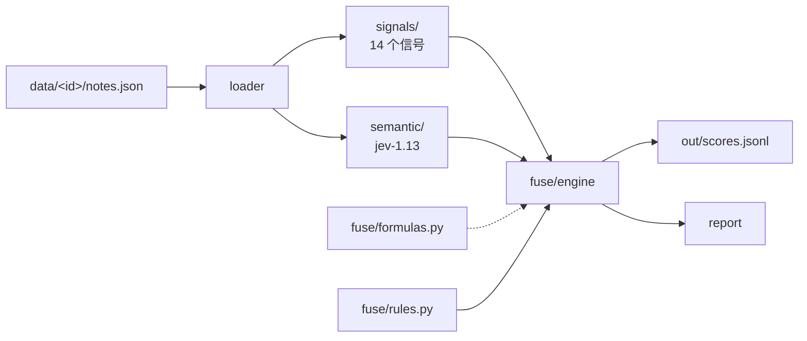

# jev2

种草真实性判别系统：**统计信号 + jev-1.13 语义判定 + 可配置融合**。

输入 `data/<note_id>/notes.json`，输出每篇的三档判定（高/中/低风险）+ 完整判定依据。

---

## 安装

```powershell
cd jev2
D:\LOreal-ai\.venv\Scripts\python.exe -m pip install -e . --no-deps
```

只用标准库，`--no-deps` 即可。凭据不写在任何文件里（见下）。

### 凭据

```powershell
# 方式一：环境变量
$env:JEV2_API_KEY = "sk-..."

# 方式二：用 opencode 的凭据（已登录就不用管）
#   从 ~/.local/share/opencode/auth.json 读 opencode-go provider
```

日志和产物里永远只有掩码形式（`sk-E...OC9a(len=67)`），
`Config.to_dict()` **没有**返回明文的口子。

---

## Quick Start

```powershell
# 1. 环境自检（key / 数据 / 模型连通 / 信号清单）
python -m jev2 doctor

# 2. 只看统计信号 —— 零模型调用、不花钱
python -m jev2 signals --note 6ab6a30e

# 3. 跑判定（信号 + 语义 + 融合）
python -m jev2 judge

# 4. 出报告（读已有结果，不调模型）
python -m jev2 report
```

40 篇全跑约 **35 秒 / $0.0019**。

---

## 命令与参数

| 命令 | 作用 | 调模型 |
|---|---|---|
| `doctor` | 环境自检 | 1 次探测 |
| `signals` | 只看统计信号 | ❌ |
| `judge` | 完整判定 | ✅ |
| `report` | 出报告 | ❌ |
| `rules` | 列出规则集与权重 | ❌ |
| `calibrate` | 阈值扫描（需标注文件） | ❌ |

### `signals`

| 参数 | 说明 |
|---|---|
| `--note PREFIX` | 只跑某篇（note_id 前缀） |
| `--out FILE` | 输出到文件（默认打到终端） |

### `judge`

| 参数 | 说明 |
|---|---|
| `--note PREFIX` | 只跑某篇 |
| `--limit N` | 最多跑几篇 |
| `--force` | 重跑已有结果的篇（默认跳过，省钱） |
| `--no-semantic` | 只用统计信号，**不调模型、不需要 key** |
| `--report` | 跑完出简报 |
| `--report-path FILE` | 把 Markdown 报告写到该文件 |

### `report`

| 参数 | 说明 |
|---|---|
| `--top N` | 风险清单条数（默认 15） |
| `--out FILE` | 输出路径（默认 `out/REPORT.md`） |

### `calibrate`

| 参数 | 说明 |
|---|---|
| `--labels FILE` | 人工标注（JSONL），格式见下 |

```jsonl
{"note_id": "6ab6a30e0000000015000da7", "label": "high"}
{"note_id": "6931e77a000000001e033f7b", "label": "low"}
```

全局参数：`--config FILE` 指定配置文件，`--version`。

---

## 架构

```
jev2/src/jev2/
  config/
    schema.py           所有配置的 dataclass + schema_version
    __init__.py         load_config()：默认 → 文件 → 环境变量 → overrides
  core/
    types.py            NoteRecord / SignalResult / DimScore / Verdict
    errors.py           异常层级（不同异常不同处置）
    registry.py         通用注册表（信号与问题共用）
  loader.py             notes.json → NoteRecord（唯一认识数据结构的地方）
  signals/              ★ 一信号一文件，注册表自动发现
    base.py             @signal 装饰器 + SignalSet
    _lib.py             共享数学工具（纯函数）
    comment_len_sd.py   ……共 14 个信号
  semantic/
    provider.py         jev-1.13 HTTP 客户端（坑都实测过）
    questions.py        问题注册表（措辞已 A/B 校准）
    runner.py           state 拼装 + 调用 + 归一化
  fuse/
    formulas.py         ★ 公式库：指标函数 + 逻辑门（纯函数）
    rules.py            ★ 规则集：声明式决策逻辑
    engine.py           求值引擎（写一次就不动）
  pipeline/
    runner.py           编排：load → signals → semantic → fuse → store
    store.py            scores.jsonl 读写（幂等）
  report.py             报告渲染
  cli.py                命令行入口
```



---

## 原理

### 核心原则：引擎写一次，内容全部数据化

框架里每个「还没敲定」的量都有一个**专门的接缝**，改它不用动引擎：

| 想改什么 | 动哪里 |
|---|---|
| 加一个统计信号 | `signals/` 丢个新文件，写 `@signal` 装饰器 —— 自动发现 |
| 加一个语义维度 | `questions.py` 注册 spec + `config.toml` 的 `dims` + `weights` |
| 改融合逻辑 | `fuse/rules.py` 换规则集，或 config 改 `weights`/`veto` |
| 改档位阈值 | config 的 `high` / `low`（想二值化就让 `low == high`） |
| 启用 L2 统计信号计分 | config 的 `weights` 加一个 `l2_mean` 键 |

### 三层分工

```
L2 统计信号  →  Python 算（免费、可解释）
L1 语义维度  →  jev-1.13 判（花钱，但能读懂话）
融合         →  加权 + 一票否决
```

**统计信号不喂给模型** —— jev 是语义判断器，给它「SD=5.62」它算不过 Python。

### 一票否决（veto）

只有 `is_ad >= 0.85` 能一票判高风险。依据来自 legacy-jev 的实测：

- 加权平均会把纯广告稀释：官方活动贴 `is_ad=0.96` 被拉到加权 0.642 → 误判中风险
- 加这道门后**高风险召回 40% → 100%**
- **但不能让 `is_cta` 也短路** —— 曾经放开过，结果 `is_cta=0.88` 误判了一篇成分党硬核测评。**强引导 ≠ 高风险**

### 缺失是一等公民

样本不足时信号返回 `missing` + 原因，**绝不返回 0**。
「0 风险」和「没法算」是两回事 —— 混同会让报告把「没数据」显示成「很干净」。
融合时缺失的规则被跳过并记录，分母也相应扣掉。

### 幂等与可追溯

- `scores.jsonl` 按 `note_id` upsert，重跑不重复
- 每行带 `run_id` / `config_hash` / `schema_version` ——
  改了阈值之后，新旧结果能区分（报告里会警告「混了 N 次运行」）
- 每行的 `trace` 记录每条规则算出了什么、有没有跳过、贡献多少

---

## 输出

### `out/scores.jsonl`

每篇一行：

```jsonc
{
  // ── 元信息（每次运行都带）──
  "schema_version": 1,
  "run_id": "20261011-012318-37bcc8",
  "config_hash": "7f03405582a9",
  "model": "jev-1.13",
  "rule_set": "default",
  "scored_at": "2026-10-11T01:23:18",

  // ── 裁决 ──
  "note_id": "6ab6a30e0000000015000da7",
  "total": 1.0,                  // 0..1
  "level": "high",               // low | medium | high
  "level_label": "高风险",
  "vetoed_by": "ad_gate",        // 被哪条一票否决命中（空 = 没有）
  "notes": ["一票否决命中：ad_gate（is_ad ≥ 0.85 …）"],

  // ── 语义维度 ──
  "dimensions": {
    "is_ad":        {"name": "is_ad", "value": 0.94, "confidence": null},
    "has_risk":     {"name": "has_risk", "value": 0.67, "confidence": null},
    "exaggeration": {"name": "exaggeration", "value": 0.41, "confidence": 0.85},
    "is_cta":       {"name": "is_cta", "value": 0.48, "confidence": null}
  },

  // ── 统计信号（含缺失）──
  "signals": {
    "comment_len_sd": {
      "name": "comment_len_sd", "value": 0.0, "n": 18,
      "missing": false, "missing_reason": "",
      "detail": {"sd": 22.02, "mean": 26.0, "min_len": 6, "max_len": 120}
    },
    "comment_like_rate": {
      "name": "comment_like_rate", "value": null, "n": 20,
      "missing": true,
      "missing_reason": "20 条评论点赞全为 0 —— 疑似匿名态未填充该字段，不作为刷评证据"
    }
  },

  // ── 判定过程（调阈值时的依据）──
  "trace": [
    {"rule": "ad_gate", "action": "veto", "value": 1.0, "weight": 0.0,
     "contribution": 0.0, "skipped": false, "reason": "is_ad=1.000 ≥ 0.85"},
    {"rule": "risk", "action": "contribute", "value": 0.67, "weight": 0.35,
     "contribution": 0.2345, "skipped": false, "reason": ""},
    {"rule": "l2_stats", "action": "flag", "value": 0.323, "weight": 0.0,
     "contribution": 0.0, "skipped": false,
     "reason": "l2_mean=0.323（仅记录，不计分）"}
  ],

  "semantic_ok": true,
  "elapsed_ms": 812,
  "note": {"title": "惊喜盒子｜小棕瓶限时掉落", "author": "雅诗兰黛",
           "liked": 3961, "comment_count": 1311, "comments_got": 18, "images": 2}
}
```

`semantic_ok: false` 表示该篇模型调用失败，**分数只含统计信号**（会偏低）——
这不是「判定为干净」，报告里会单独警告。

### `out/REPORT.md`

```
- 共 40 篇
- 档位：高风险 6 · 中风险 9 · 低风险 25
- 一票否决命中：3 篇
- 总分：min 0.035 · 中位 0.189 · max 1.000 · 均 0.316

## 风险最高的 20 篇
| # | note_id | 总分 | 档位 | 主要维度 | 否决 | 标题 |
...
## 语义维度分布
## 统计信号分布
## 最高分那篇的判定过程
```

---

## 14 个统计信号

| 信号 | 测什么 | 方向 | 实测分布（40 篇） |
|---|---|---|---|
| `like_comment_ratio` | 赞评比 | 越高越可疑 | 0.3~58.3，中位 3.2 |
| `comment_like_rate` | 评论点赞非零率 | 越低越可疑 | **全缺失**（见下） |
| `ip_top1_ratio` | IP top1 占比 | 越高越可疑 | 0.1~0.7，中位 0.3 |
| `ip_entropy` | IP 分布熵 | 越低越可疑 | 0.70~1.00 |
| `comment_len_sd` | 评论长度标准差 | 越小越可疑 | 2.4~62.2，中位 11.4 |
| `comment_len_mean` | 评论平均长度 | 越短越可疑 | 5.8~42.4，中位 18.1 |
| `comment_len_iqr` | 长度四分位距 | 越小越可疑 | 2~45，中位 12.9 |
| `low_effort_ratio` | 低信息量评论占比 | 越高越可疑 | 0~0.8，中位 0.2 |
| `sub_reply_ratio` | 楼中楼占比 | 越低越可疑 | 0~0.8，中位 0.7 |
| `author_reply_ratio` | 作者自评占比 | 越高越可疑 | 0~0.5，中位 0.1 |
| `comment_time_span` | 评论时间跨度 | 越集中越可疑 | 887~277403 分钟 |
| `nickname_dup_rate` | 昵称重复率 | 越高越可疑 | 0~0.6，中位 0.3 |
| `text_exclaim_density` | 感叹号密度 | 越高越可疑 | 每百字 0~3 |
| `text_length` | 正文长度 | 两个极端可疑 | 20~700 字 |

**阈值全部按实测分位数定的，不是拍脑袋**。改阈值前先看
`signals/*.py` 里各自的 docstring —— 那里写了取值依据。

### 两个已知限制

**`comment_like_rate` 当前恒为 missing。** 匿名态 SSR 拿到的
`like_count` 全部是 `0`（498/498），这不是「真没人赞」而是字段未填充。
所以该信号主动返回 missing（带原因），**不拿它当刷评证据** ——
否则会误伤所有帖。换数据源后自动生效。

**`comment_time_span` 只测首屏评论。** 匿名态每篇只给 5 条一级评论，
所以这个「跨度」是一小撮评论内部的分散度，不是整个评论区的活跃曲线。
因此风险上限压到 0.6，不让它单独把人推向高风险。

---

## 融合

### 公式库（`fuse/formulas.py`）

纯函数，只算数不做决策，逐个有单测。

| 类别 | 函数 |
|---|---|
| 指标函数 | `indicator_ge` / `indicator_le` / `indicator_band` / `linear` / `logistic` / `band` / `identity` |
| 逻辑门 | `AND` / `OR` / `NOT` / `at_least` / `at_most` / `mean_of` |
| 聚合 | `weighted` / `veto` |

> `band` 的方向锁死了：**区间内 → 0（正常），区间外才上升**。
> 这里写反过一次，导致 379 字的正常正文被判满风险 —— 有单测兜着。

### 规则集（`fuse/rules.py`）

```python
Rule(name="ad_gate",
     action="veto",                      # veto | contribute | flag
     formula=indicator_ge,
     args={"t": 0.85},                   # 参数是数据
     inputs=("is_ad",))
```

内置三套：`default`（默认）、`strict`（veto 线降到 0.75 + L2 进权重）、
`semantic_only`（不看统计信号，用于和 legacy-jev 对比）。
config 里 `fuse.rule_set` 切换。

加逻辑门组合不用改引擎：

```python
Rule(name="ad_and_risk", action="veto", formula=AND,
     inputs=("is_ad", "has_risk"))
```

### 默认权重

```toml
weights = { has_risk = 0.35, exaggeration = 0.30, is_ad = 0.25, is_cta = 0.10 }
veto    = { is_ad = 0.85 }
high    = 0.70
low     = 0.30
```

权重继承 legacy-jev（已验证二值一致率 95.8%），**不是拍脑袋定的**。
没有 ground truth 之前不要随手改 —— n=40 时新权重就是过拟合。

### L2 统计信号默认不进权重

它们输出到产物里供观察（`l2_stats` 规则是 `flag` 动作），但不参与计分。
想启用就在 config 的 `weights` 里加 `l2_mean = 0.15` ——
引擎会自动把规则从 `flag` 提升为 `contribute`，**不用改代码**。

建议等 `calibrate` 用人工标注验证过再启用。

---

## 开发

```powershell
# 151 个用例
D:\LOreal-ai\.venv\Scripts\python.exe -m pytest jev2/tests -q
```

测试重点锁三类东西：

1. **风险方向**：每个信号「越大越可疑」还是「越小越可疑」——
   写反过两次（`band_risk` 逻辑倒置、`ip_entropy` 条件写错），
   两次都是「信号恒 0」这种静默失效，不测根本发现不了
2. **缺失语义**：样本不足必须 missing + 原因，不能返回 0
3. **可扩展性**：换规则集 / 加权重键 / 自动发现信号都要有测试兜住

改动前先读 `semantic/provider.py` 开头的坑列表（Cloudflare UA 等）。

---

## 与 legacy-jev 的关系

`legacy-jev/` 是旧系统，**保留为对照基线**（二值一致率 95.8%，kappa 0.701）。
jev2 继承了它的三样东西：

1. **问题措辞**（`has_risk` 的措辞是 22 次 A/B 换来的，一致率 66.7% → 83.3%）
2. **一票否决阈值的依据**（is_ad ≥ 0.85）
3. **provider 的实现**（UA/节流/重试都是实测过的坑）

jev2 必须**在同一批数据上跑赢它**才算成功 —— 不能自己跟自己比。
对比方式：`judge --no-semantic`（纯统计）vs `rule_set = "semantic_only"`
vs `default`，看哪个组合的一致率最高。
