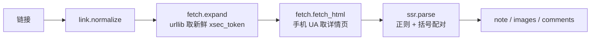

# xhs-cli

匿名免登录采集小红书笔记：**文案 / 图片 / 评论**。

只用 Python 标准库 `urllib` —— 不需要浏览器、不需要 Playwright、
不需要 cookie、不需要登录。

---

## 安装

```powershell
cd xhs-cli
D:\LOreal-ai\.venv\Scripts\python.exe -m pip install -e . --no-deps
```

`--no-deps` 是有意的：只用标准库，不需要装任何东西。

---

## Quick Start

```powershell
# 人读输出
python -m xhs_cli parse "https://xhslink.cn/o/9yWznlCm2pp"

# 落成目录：<DIR>/<note_id>/{图片, notes.json}   ← 推荐
python -m xhs_cli parse "https://xhslink.cn/o/9yWznlCm2pp" --out data

# 存成单个 JSON 文件（Windows 控制台看中文会乱码，读文件最省事）
python -m xhs_cli parse "https://xhslink.cn/o/9yWznlCm2pp" --save note.json

# JSON 打到屏幕
python -m xhs_cli parse "https://xhslink.cn/o/9yWznlCm2pp" --json
```

抓两篇进同一个目录（`--out` 可重复用，每篇自己一个子目录）：

```
data/
  6ac3c7f4000000001b02fc03/
    01.jpg
    02.jpg
    notes.json
  6ac9205b0000000014001c57/
    01.jpg
    notes.json
```

链接支持四种写法：

| 形态 | 例子 |
|---|---|
| 手机短链（推荐） | `https://xhslink.cn/o/9yWznlCm2pp` |
| 长链带 token | `https://www.xiaohongshu.com/explore/<24位id>?xsec_token=...` |
| 长链无 token | `https://www.xiaohongshu.com/explore/<24位id>` |
| 缺协议头 | `www.xiaohongshu.com/explore/<24位id>` |

> Windows 控制台乱码是 PowerShell 按 GBK 解码 UTF-8 导致的，数据本身没问题。
> 加 `--out` / `--save` 读文件，或先执行 `chcp 65001`。

---

## 命令与参数

只有 `parse` 一个命令。

```powershell
python -m xhs_cli parse "<链接>"
```

| 位置/参数 | 必填 | 默认 | 说明 |
|---|---|---|---|
| `link` | ✅ | — | 小红书短链或长链 |
| `--out DIR` | | 无 | 落成目录 `<DIR>/<note_id>/{图片, notes.json}` |
| `--json` | | 关 | 输出机器可读 JSON |
| `--save FILE` | | 无 | 把 JSON 写进单个文件 |

三个落盘参数可以**任意组合**，互不冲突。

退出码：`0` 成功 · `2` 链接不支持 · `3` 抓取失败 · `4` 目录写入失败。

---

## 架构

```
xhs-cli/src/xhs_cli/
  core/                 ★ 采集链路（只用标准库）
    link.py             链接归一化：短链 / 长链 / 缺协议 → LinkRef
    fetch.py            urllib 直连 + 手机 UA
    ssr.py              HTML → 结构化字段
    ssr_json.py         括号配对提取嵌套数组（评论 / tagList）
    service.py          parse_link()：重试 + 换 token
  cli.py                命令行入口
```



---

## 原理

### 1. 三条铁律

1. **必须手机 UA。** 桌面 UA 会 302 到登录页，而 **HTTP 状态码仍是 200** ——
   只判状态码会静默拿到一个废页面。所以展开后必须校验最终 URL。
2. **必须 `urllib`。** 实测它的 TLS 指纹能过。
   `requests` / `httpx` / `curl_cffi` **未验证，不要替换**。
3. **不复用连接。** 不开 `Session`、不加 keep-alive，每次新建 `Request`。

### 2. 短链优先

短链（`xhslink.cn/o/xxx`）每次展开都由平台**新签发** `xsec_token`；
长链里写死的 token 几小时就失效。所以优先保存短链。

### 3. SSR 是 JS 字面量，不是 JSON

详情页把数据塞在 HTML 的 JS 对象里，含 `undefined`、尾随逗号，不能直接 `json.loads`。

```
HTML
 ├─ prepare()      只反转义 \u002F 与 \/（不碰 \" —— 会切断字段边界）
 ├─ 正则取标量      title / desc / likedCount / shareCount ...
 ├─ 括号配对取数组  "commentData":{"comments":[ → 深度扫描跳过字符串与转义 → json.loads
 └─ 摊平           一级评论在前，其楼中楼紧跟其后
```

**评论为什么必须括号配对**：SSR 里一级评论的 `user` 与 `content` 之间
隔着整个 `subComments` 数组（实测 1000~1500 字），任何「最近距离配对」都会错配；
而且 `user` 相对 `content` 的位置在一级评论与楼中楼里**正好相反**。
按括号配对取整段 JSON 是唯一不依赖字段顺序的做法。

### 4. 降级链

```
HTTP 直连
  ↓ token 类失败（detail_http_* / expand_no_token / expand_login）
重新展开短链换新 token
  ↓ 拿到 HTML 但关键字段全空（EmptyDataError）
重新展开短链换新 token
  ↓ 限流 / 网络类失败
指数退避 1s → 2s → 4s
  ↓ 仍失败
抛 FetchError（带 kind）
```

最长 4 次尝试（`BACKOFF = (1, 2, 4)`）。

---

## 输出

### A. `--out` 目录（推荐）

```powershell
python -m xhs_cli parse "https://xhslink.cn/o/9yWznlCm2pp" --out data
```

```
data/<note_id>/
  01.jpg      图片，序号与 notes.json 的 images 数组下标对齐
  02.jpg
  notes.json  完整数据（笔记 + 图片 + 评论）
```

- **图片按内容判扩展名**（`.jpg` / `.png` / `.gif` / `.webp`）——
  小红书 CDN 的 URL 是 `...!h5_1080jpg` 这种伪后缀，没有点号，
  看 URL 拿不到扩展名。
- 文件名序号 = `images` 数组下标，**不重新编号**。
  所以第 2 张图挂了时，剩下的是 `01.jpg` / `03.jpg`，
  反查回去就知道缺的是哪一张。
- 单张图下载失败**不会让整篇失败**，会记在 `notes.json` 的 `image_errors` 里。

### B. JSON（`--save` / `--json` / `notes.json` 同一结构）

```powershell
python -m xhs_cli parse "https://xhslink.cn/o/9yWznlCm2pp" --save note.json
```

`note.json` 结构（真实抓取结果）：

```jsonc
{
  "note_id": "6ac3c7f4000000001b02fc03",
  "note": {
    "note_id": "6ac3c7f4000000001b02fc03",
    "title": "学生心理需要重视",
    "desc": "#我在小红书聊心理[话题]# #学生压力大[话题]# …",
    "author": "胦鱼",
    "author_id": "667659460000000007007fc4",
    "ip_location": "",              // ⚠️ 匿名态拿不到，见「字段可用性」
    "liked": "7546",                // 计数都是字符串
    "collected": "618",
    "comment_count": "523",         // 页面声明的总数（一级 + 楼中楼）
    "comment_count_l1": "226",      // 其中一级评论数
    "share": "176",
    "time_ms": "1791215604000",     // 毫秒时间戳（字符串）
    "tags": ["我在小红书聊心理", "学生压力大", "…", "笔记", "我在小红书聊心理", "…"],
    "images": ["http://sns-webpic-qc.xhscdn.com/…!h5_1080jpg"]
  },
  "images": ["http://sns-webpic-qc.xhscdn.com/…!h5_1080jpg"],  // = note.images
  "comments": [
    {
      "user_id": "61599e8000000000020234ab",
      "nickname": "长夜.",
      "content": "一共才十四亿人，但是精神病人数接近两亿…",
      "ip_location": "山东",         // 评论 IP 可得
      "like_count": "0",            // 字符串
      "time": 1791470300000,        // 整数（毫秒）
      "is_author": false,
      "_is_reply": false
    },
    {
      "user_id": "667659460000000007007fc4",
      "nickname": "胦鱼",
      "content": "骗你的，其实本人也坚持不了也有抑郁[笑哭R]",
      "ip_location": "浙江",
      "like_count": "0",
      "time": 1791470950000,
      "is_author": false,
      "_is_reply": true,            // true = 楼中楼
      "_parent_id": "6ac7aadb…"     // 仅楼中楼有此字段，指向父评论 id
    }
  ],
  "declared": 523,                  // 页面声明的评论总数
  "got": 20,                        // 实际拿到多少条
  "complete": false,                // got >= declared
  "elapsed_ms": 426,

  // 下面两个键仅 --out 时有（即 notes.json）
  "image_files": ["01.jpg"],        // 本地存下来的文件名
  "image_errors": []                // 失败的那些，空=全成功
}
```

字段要点：

| 字段 | 说明 |
|---|---|
| `note.*` 的计数字段 | 都是**字符串**（`"7546"`），不是数字 |
| `time_ms` | **毫秒**时间戳，字符串 |
| 评论 `time` | **毫秒**时间戳，整数 |
| 评论 `like_count` | 字符串，可能是 `"1千+"` 这类展示值 |
| `_is_reply` | `true` = 楼中楼；一级评论为 `false` |
| `_parent_id` | **只有**楼中楼才有 |
| `comments` 顺序 | 一级评论 + 其楼中楼紧跟其后，非严格时间序 |
| `complete` | `got >= declared`；匿名态几乎总是 `false` |
| `image_files` | 仅 `--out` 时有。本地图片文件名列表 |
| `image_errors` | 仅 `--out` 时有。下载失败的图（`index`/`url`/`error`） |

---

## 字段可用性（2026-10-11 实测）

| 数据 | 状态 | 说明 |
|---|---|---|
| 标题 / 正文 | ✅ | 需有效 token |
| 话题标签 | ⚠️ | **有重复项**（见「已知问题」） |
| 图片 URL | ✅ | 同一张图在 SSR 里有多个 CDN 变体，已去重 |
| 帖子点赞 / 收藏 / 评论数 / 分享数 | ✅ | 部分笔记不公开该数字，此时为空串 |
| 发布时间 | ✅ | `time_ms` |
| 作者昵称 / ID | ✅ | |
| **作者 IP 属地** | ❌ | note 区**没有任何** IP 字段 |
| 一级评论 | ⚠️ **只有 5 条** | 不论该帖实际有多少 |
| 该 5 条一级评论下的楼中楼 | ✅ | 全部带出 |
| 评论者昵称 / 正文 | ✅ | |
| **评论 IP 属地** | ✅ | |
| 评论点赞 | ⚠️ | 绝大多数是真实的 0 |
| 评论翻页（第 6 条一级起） | ❌ | 分页接口返回 461 |
| 搜索页 / 用户主页 | ❌ | 登录墙 |

两个最容易误解的点：

**「前十条」是错的，实际是「5 条一级评论 + 其下全部楼中楼」。**

| 帖 | 平台标称一级评论 | 实际内联 |
|---|---:|---:|
| `6a5c65d3` | 106 | **5** |
| `6ab6a30e` | 1874 | **5** |

所以总条数可以远超 5（楼中楼能带出几十上百条），但**楼层数被锁在 5**。

**作者 IP 匿名态拿不到。** note 区的 `user` 对象只有
`userId` / `nickName` / `avatar` / `redOfficialVerifyType`；
试过 `ipLocation` / `ipProvince` / `ipCity` / `locatedCity` / `publishLocation`
等 13 个候选键名，note 区全部 0 命中。全文的 `ipLocation` 都在 `commentData` 区内，
那些是**评论者**的 IP。

---

## 已知问题

| # | 问题 | 影响 |
|---|---|---|
| 1 | `tags` 有重复项，且混入假标签「笔记」 | 该字段不能直接用 |

**成因**：`ssr.parse_note` 用全局正则 `"name":"…"` 取标签，两个后果 ——

- 页面里有 `"tabs":[{"id":"note","name":"笔记"}]`，「笔记」被当成标签；
- `tagList` 在 SSR 内联与水合数据里各存一份，于是每项重复两遍。

实测一帖 4 个真标签会输出 9 项：

```python
['我在小红书聊心理', '学生压力大', '教育理念的重要性', '以学生为中心',
 '笔记', '我在小红书聊心理', '学生压力大', '教育理念的重要性', '以学生为中心']
```

**临时处理**：读之前先清洗 ——

```python
def clean_tags(tags):
    out = []
    for t in tags:
        t = t.strip()
        if t and t != "笔记" and t not in out:
            out.append(t)
    return out
```

---

## 失败分类

`FetchError.kind`：

| kind | 含义 |
|---|---|
| `expand_no_token` | 展开结果没有 `xsec_token` |
| `expand_login` / `expand_login_body` | 短链被跳到登录页 |
| `expand_http_{code}` | 展开时 HTTP 错误 |
| `expand_network` | 展开时网络故障 |
| `detail_http_{code}` | 详情页 HTTP 错误（401 / 461 等） |
| `detail_network` | 详情页网络故障 |
| `exhausted` | 重试 4 次后仍失败 |
| `UnsupportedLink` | 链接形态不支持（**不是** FetchError，不重试） |

拿到 HTML 但关键字段全空会抛 `EmptyDataError`，同样触发换 token 重试。

---

## 开发

```powershell
# 测试（39 个用例）
D:\LOreal-ai\.venv\Scripts\python.exe -m pytest xhs-cli/tests -q
```

改动前请先读 `core/fetch.py` 开头的三条铁律、
以及 `core/ssr_json.py` 的注释（记录了 7 轮正则迭代的失败原因）。
